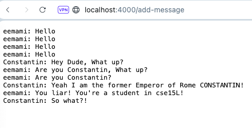

# Chat Server Explanation

## Overview of the code & running the server:
Here is the code:


Here is the ChatServer running:





This page provides a simple explanation of how messages are added to a chat using ChatServer.java.
Every time a message is added, like "Hello" from "eemami" or "Constantin"  "be the Emperor of Rome", the server performs a series of steps to update the chat history.

 ### Which methods in your code are called?
 
When interacting with the chat server, specifically when adding messages through the `/add-message` endpoint, the following method is involved:

### `handle(HttpExchange exchange)`

This method is the core of our `ChatHandler` class, designed to respond to HTTP requests. Here's a brief overview of its role in processing chat messages:

- **Purpose:** Handles incoming HTTP requests to the server, parsing the request URI to act accordingly based on the specified path and query parameters.
  
- **Process:**
  1. **Parse Request:** Extracts the request URI and query parameters (`s` for the message and `user` for the username).
  2. **Update Chat History:** Appends the new message to the `chatHistory` string in the format `<user>: <message>\n`.
  3. **Respond:** Sends back the updated chat history to the requester, showing the entire conversation so far.

Every time a user adds a message to the chat, this method is called to process the request and update the server's state accordingly.

### What are the relevant arguments to those methods, and the values of any relevant fields of the class?

- **`HttpExchange exchange`:** This object contains all the details of a single HTTP request-response transaction. It includes the request URI, which has the path `/add-message` and the query parameters `s` (the message) and `user` (the username), for processing chat messages.

### How do the values of any relevant fields of the class change from this specific request? If no values got changed, explain why.

- **Field:** `String chatHistory`

  - **Before First Request:** Initially, `chatHistory` starts as an empty string `""` which when we open the link the page shows the very
      first screenshot.

  - **After First Request** (`/add-message?s=Hello&user=eemami`):
    - `chatHistory` is updated to `"eemami: Hello\n"`.
  - **After Multiple Requests:** Each additional request further appends a message to `chatHistory` in the format `<user>: <message>\n`. Below is the example I used to execute the ChatServer.java

    ```
    eemami: Hello
    eemami: Hello
    eemami: Hello
    eemami: Hello
    Constantin: Hey Dude, What up?
    eemami: Are you Constantin, What up?
    eemami: Are you Constantin?
    Constantin: Yeah I am the former Emperor of Rome CONSTANTIN!
    eemami: You liar! You're a student in cse15L!
    Constantin: So what?!
    ```

    This shows the chat history being sequentially updated with each new message, formatted as `<user>: <message>` followed by a newline character.

### Explanation:

- Upon receiving a chat message through the `/add-message` endpoint, the server's `handle` method is invoked with the `HttpExchange` object.
- This method extracts the `user` and `s` (message) values from the query parameters of the request URI.
- These values are then used to append the new message to the `chatHistory` field in the specified format.
- The `chatHistory`, now containing the updated conversation, is included in the server's response, allowing users to view the ongoing chat history.

### The absolute path to the private key for your SSH key for logging into ieng6 (on your computer, an EdStem workspace, or on the home directory of the lab computer)
  
  The path for private ssh: `/Users/Stockmarket/.ssh/id_rsa`
  
 The path above is the absolute path for the private key.

### The absolute path to the public key for your SSH key for logging into ieng6 (this is the one you copied to your account on ieng6, so it should be a path on ieng6's file system)
 The path for public ssh: `/Users/Stockmarket/.ssh/id_rsa.pub`

 #### Screenshot of login to the the remote server of ieng6 without password using the public key:
 
 


 #### using the ls command to show the files created using ssh-keygen:

  
