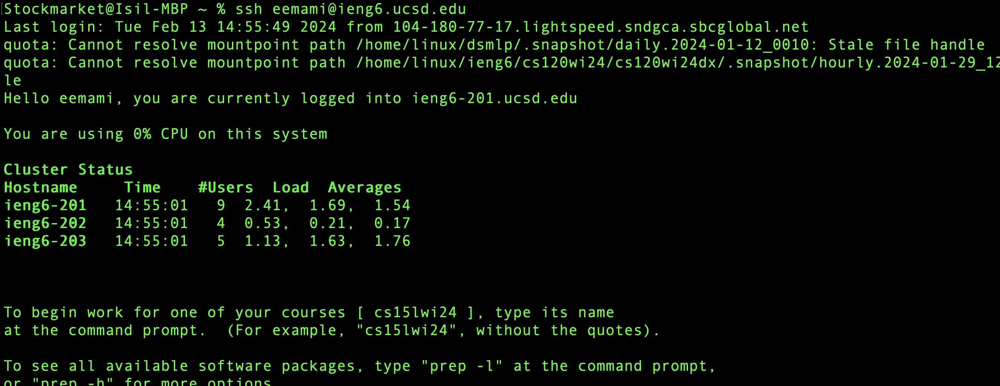
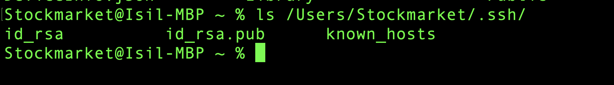

### The absolute path to the private key for your SSH key for logging into ieng6 (on your computer, an EdStem workspace, or on the home directory of the lab computer)
  
  The path for private ssh: `/Users/Stockmarket/.ssh/id_rsa`
  
 The path above is the absolute path for the private key.

### The absolute path to the public key for your SSH key for logging into ieng6 (this is the one you copied to your account on ieng6, so it should be a path on ieng6's file system)
 The path for public ssh: `/Users/Stockmarket/.ssh/id_rsa.pub`

 #### Screenshot of login to the the remote server of ieng6 without password using the public key:
 
 

 #### using the ls command to show the files created using ssh-keygen:

  

### What I have learned:

One of the most important this I learned are the commands that I used to interact with computer using terminal, suach as 
locating the directories, creating new directories. Another important skill is that we can run programs of any kind on a local server without using the computation power of the local computer or the storage, by downlading the main files to the remote server and running them remotely. Creating ssh-keys to enter the server without entering the password everytime is an interresting idea that I learned in this lab.
