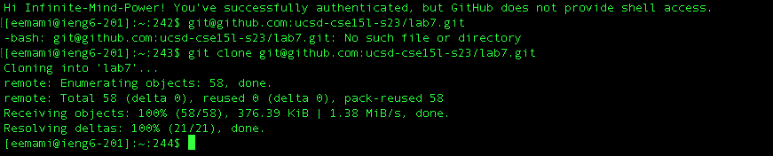
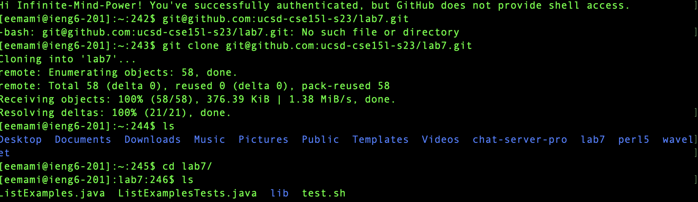
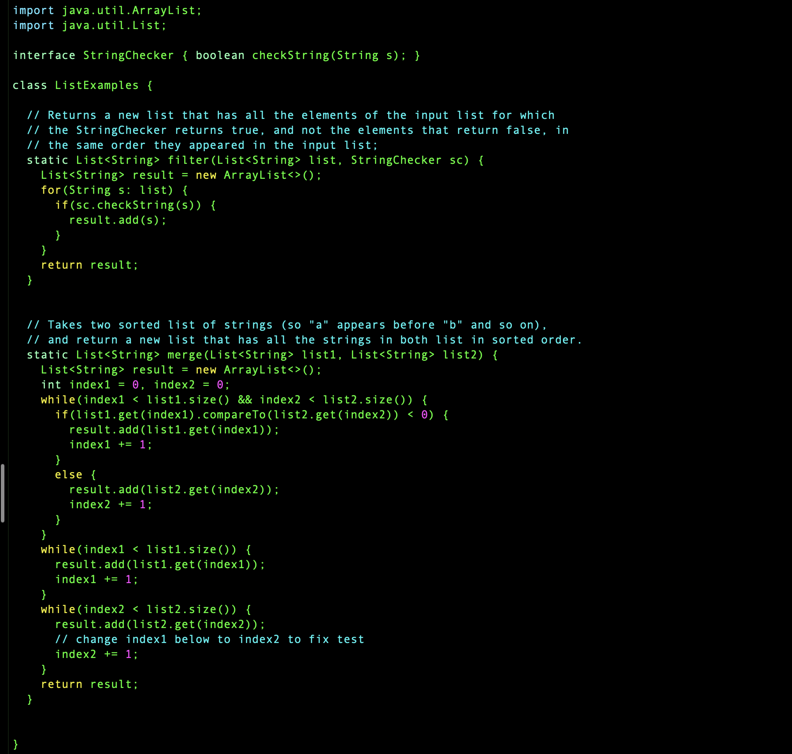
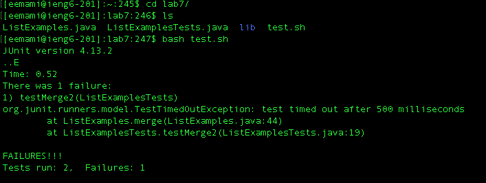
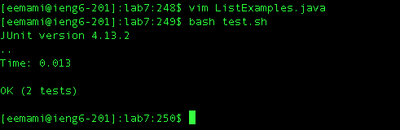
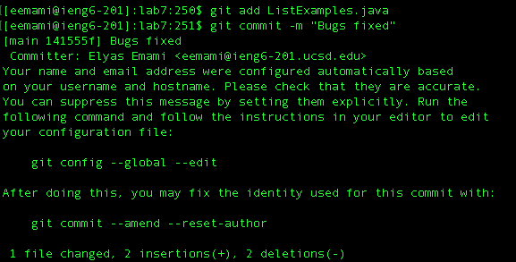

# Lab Report 4 - Vim and Command Line Efficiency

## Introduction

This lab focused on debugging Java code using Vim and improving workflow efficiency through command line techniques. The main task involved fixing a bug in a method that merges two sorted lists.
## SSH key:

First I generated a SSH key for github authentication.

## Cloning process
After authentication of my ucsd account I was able to clone the repo.

### Debugging Steps

#### Step 4: Cloning the Repository

Cloned the repository to start the debugging process.

- **Keys Pressed**: `git clone <SSH URL>` `<enter>`
- **Effect**: Cloned my GitHub repository to the ieng6 account.

#### Step 5: Running the Tests (Before Fix)

Ran the tests to demonstrate the failure and identify the bug.

- **Keys Pressed**: `<up>` `<enter>`
- **Effect**: Tests failed, indicating a bug in the code.

#### Step 6: Editing with Vim to Fix the Bug

Opened the file in Vim, navigated to the bug, and edited the code.

- **Keys Pressed**: `vim ListExamples.java` `<enter>` `/<buggy_method>` `<enter>` `i`
- **Code Change**: Changed `index1 += 1;` to `index2 += 1;` in the `merge` method's second `while` loop.
- **Effect**: Fixed the logical error.

#### Step 7: Running the Tests (After Fix)

Reran the tests to ensure the bug was fixed.

- **Keys Pressed**: `<up>` `<up>` `<enter>`
- **Effect**: Tests succeeded, confirming the fix.

#### Step 8: Committing and Pushing the Changes

Committed the fixed code and pushed the changes to GitHub.

- **Keys Pressed**: `git add ListExamples.java` `<enter>` `git commit -m "Fix merge bug"` `<enter>` `git push` `<enter>`
- **Effect**: Updated the repository with the fixed code.

### Using Bash History

up/down arrows and Ctrl-R to quickly access previous commands.

### Using Tab for Autocompletion

The Tab key really helped with autocompleting feature to speed up command typing.

### Keyboard Shortcuts

Improved efficiency with shortcuts like Ctrl-U, Ctrl-K, Ctrl-A, Ctrl-E, Ctrl-W, and Alt-Left/Right.

## Conclusion
In this I learned how to use vim to edit and modify files on terminal and upload them into a git repository all on terminal.

