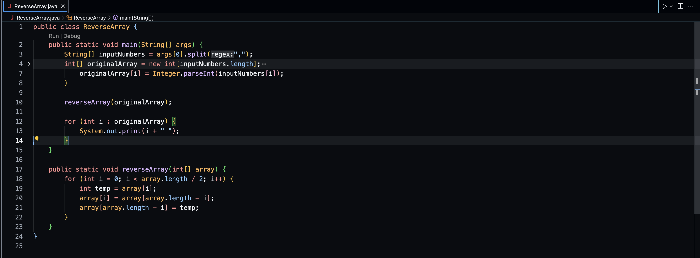
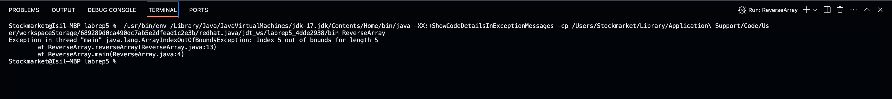
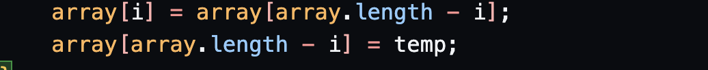
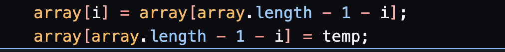
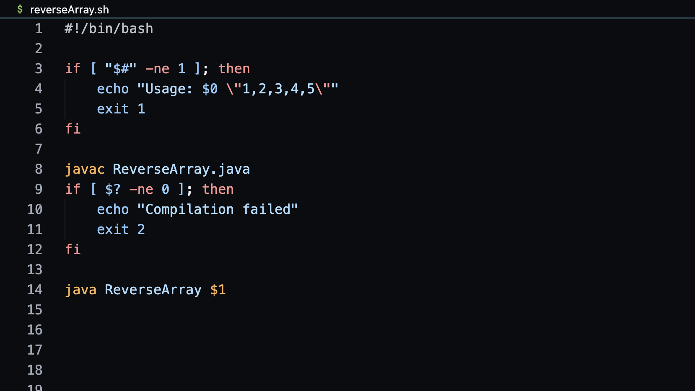
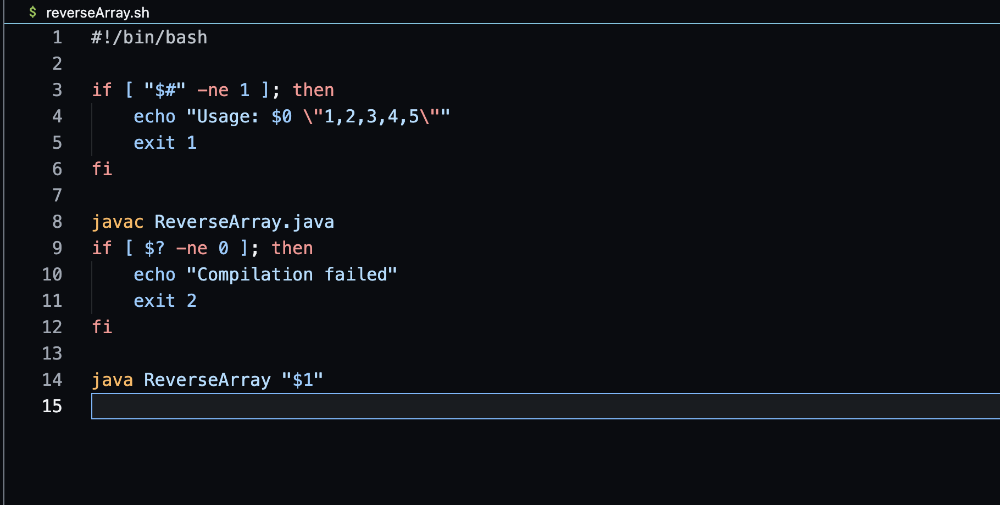
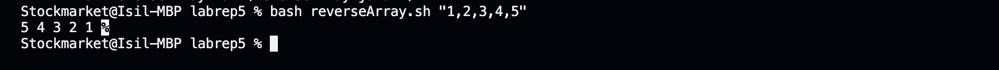

# Lab Report 5 - Debugging an Array Reversal Program in Java

### Trouble with Array Reversal Java Program

Hello everyone,

I'm having trouble with a Java program designed to reverse an array of integers inputted via command-line arguments. The program is supposed to split the input string into an array, reverse the array, and print the result. However, the output doesn't seem to reflect a correctly reversed array. Here's the Java code I'm using:

#### The code:

#### The output:

## Response from a TA:

It looks like you're on the right track suspecting the loop. When swapping elements, you should consider how you're accessing the indices of the array. Remember, arrays in Java are zero-based. Can you try adjusting the indices during the swap and see if that fixes your issue? Please share your findings after you make the adjustment.
### The bug is here:

### This might fix the code:

#### In the reverseArray method, adjust the indices used during the swap to correctly access the mirrored element in the array. Specifically, change:

## Follow-up Post by the Student:
Thank you for the quick response! Here's the Bash script I use to compile and run my Java program and I noticed that when I pass an array like "1,2,3,4,5" to the script, it doesn't always return the expected reversed array. Can someone help me figure out what's going wrong?

## Response from TA:

For the Bash script, when passing arguments from Bash to Java, if your argument includes special characters like commas, you might need to ensure they are correctly interpreted by enclosing the argument in quotes. Could you try modifying the way you pass $1 to java ReverseArray in your script and see if that resolves the issue?

### This is the updated bash code I used and now everything works perfectly thanks!:

### Running and compiling the java program using bash reversearray.sh

