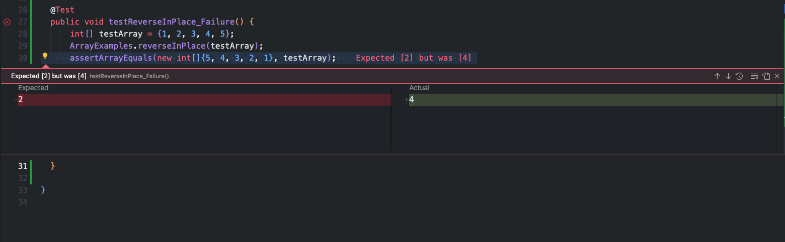

# Lab 3

## Part 1 - Bugs

## A failure-inducing input for the buggy program, as a JUnit test and any associated code:

### JUnit Test: Failure-Inducing Input

```java
import org.junit.Test;
import static org.junit.Assert.assertArrayEquals;

public class ArrayExamplesTest {

    @Test
    public void testReverseInPlace_Failure() {
        int[] testArray = {1, 2, 3, 4, 5};
        ArrayExamples.reverseInPlace(testArray);
        assertArrayEquals(new int[]{5, 4, 3, 2, 1}, testArray);
    }

}
```

## An input that doesn't induce a failure, as a JUnit test and any associated code:

### JUnit Test: Non-Failure-Inducing Input:

```java
@Test
public void testReverseInPlace_NonFailure() {
    int[] testArray = {1};
    ArrayExamples.reverseInPlace(testArray);
    assertArrayEquals(new int[]{1}, testArray);
}
```

### Symptom:
Running these tests would result in a failure of the testReverseInPlace_Failure test due to the incorrect 
behavior of the reverseInPlace method. Below is the result of running the test.

```
%FAILED 4,testReverseInPlace_Failure(ArrayTests)
%TRACES 
arrays first differed at element [3]; expected:<2> but was:<4>
        at org.junit.internal.ComparisonCriteria.arrayEquals(ComparisonCriteria.java:78)
        at org.junit.internal.ComparisonCriteria.arrayEquals(ComparisonCriteria.java:28)
        at org.junit.Assert.internalArrayEquals(Assert.java:534)
        at org.junit.Assert.assertArrayEquals(Assert.java:418)
        at org.junit.Assert.assertArrayEquals(Assert.java:429)
        at ArrayTests.testReverseInPlace_Failure(ArrayTests.java:30)
        at java.base/jdk.internal.reflect.NativeMethodAccessorImpl.invoke0(Native Method)
        at java.base/jdk.internal.reflect.NativeMethodAccessorImpl.invoke(NativeMethodAccessorImpl.java:77)
        at java.base/jdk.internal.reflect.DelegatingMethodAccessorImpl.invoke(DelegatingMethodAccessorImpl.java:43)
        at java.base/java.lang.reflect.Method.invoke(Method.java:568)
        at org.junit.runners.model.FrameworkMethod$1.runReflectiveCall(FrameworkMethod.java:59)
        at org.junit.internal.runners.model.ReflectiveCallable.run(ReflectiveCallable.java:12)
        at org.junit.runners.model.FrameworkMethod.invokeExplosively(FrameworkMethod.java:56)
        at org.junit.internal.runners.statements.InvokeMethod.evaluate(InvokeMethod.java:17)
        at org.junit.runners.ParentRunner$3.evaluate(ParentRunner.java:306)
        at org.junit.runners.BlockJUnit4ClassRunner$1.evaluate(BlockJUnit4ClassRunner.java:100)
        at org.junit.runners.ParentRunner.runLeaf(ParentRunner.java:366)
        at org.junit.runners.BlockJUnit4ClassRunner.runChild(BlockJUnit4ClassRunner.java:103)
        at org.junit.runners.BlockJUnit4ClassRunner.runChild(BlockJUnit4ClassRunner.java:63)
        at org.junit.runners.ParentRunner$4.run(ParentRunner.java:331)
        at org.junit.runners.ParentRunner$1.schedule(ParentRunner.java:79)
        at org.junit.runners.ParentRunner.runChildren(ParentRunner.java:329)
        at org.junit.runners.ParentRunner.access$100(ParentRunner.java:66)
        at org.junit.runners.ParentRunner$2.evaluate(ParentRunner.java:293)
        at org.junit.runners.ParentRunner$3.evaluate(ParentRunner.java:306)
        at org.junit.runners.ParentRunner.run(ParentRunner.java:413)
        at org.eclipse.jdt.internal.junit4.runner.JUnit4TestReference.run(JUnit4TestReference.java:93)
        at org.eclipse.jdt.internal.junit.runner.TestExecution.run(TestExecution.java:40)
        at org.eclipse.jdt.internal.junit.runner.RemoteTestRunner.runTests(RemoteTestRunner.java:529)
        at org.eclipse.jdt.internal.junit.runner.RemoteTestRunner.runTests(RemoteTestRunner.java:757)
        at org.eclipse.jdt.internal.junit.runner.RemoteTestRunner.run(RemoteTestRunner.java:452)
        at org.eclipse.jdt.internal.junit.runner.RemoteTestRunner.main(RemoteTestRunner.java:210)
Caused by: java.lang.AssertionError: expected:<2> but was:<4>
        at org.junit.Assert.fail(Assert.java:89)
        at org.junit.Assert.failNotEquals(Assert.java:835)
        at org.junit.Assert.assertEquals(Assert.java:120)
        at org.junit.Assert.assertEquals(Assert.java:146)
        at org.junit.internal.ExactComparisonCriteria.assertElementsEqual(ExactComparisonCriteria.java:8)
        at org.junit.internal.ComparisonCriteria.arrayEquals(ComparisonCriteria.java:76)
        ... 31 more

```




