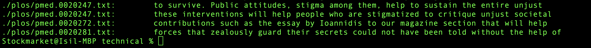
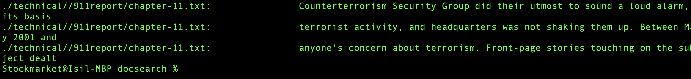

## Part 2
### My favorite command is `grep`. The reasone I chose it is becasue it is a powerfull 
### tool which can: 

- Searching text: grep can search one or more files for lines that contain a match to
a specified pattern.
- Filtering log files: It's commonly used to filter interesting entries from log files.
- Code analysis: Programmers use grep to find occurrences of a term in source codes.
- Data analysis: It can be used for quick-and-dirty data analysis, filtering lines in
data files that match a certain criterion.
- Combining with other commands: In shell scripts or command pipelines, grep is used
in conjunction with other commands to process text.

(source: Wikipedia)

#### 1. -i (Ignore case)
The -i option makes grep perform case-insensitive searching. This means grep will match lines regardless of whether the characters are 
upper or lower case.
 
 Example 1: Search for the word "states" in all text files, ignoring case
  
 `grep -i "states" ./plos/*.txt`
  
  output:
  
  

Example 1: Search for the word "configuration" in a specific document, ignoring case
 
 `grep -i "configuration" ./technical/plos/*.txt`
 
 output:
 
 

 This command searches for the term "network" in all .txt files within the ./technical directory, ignoring case. It's useful when the 
 casing of the search term is unknown or mixed.

#### 2. -r or -R (Recursive search)
The -r (or -R, which is equivalent) option enables recursive search, allowing grep to search through directories and their subdirectories for the pattern.

 Example 1:
   
 `grep -r "error" ./technical/plos/*.txt`

  output:

  
   

 Example 2: Recursively search for "error" in all files within the ./technical/ directory without the specific folder name.
 
 `grep -ri --include="*.md" "todo" ./technical/

 output:

 

#### 3. -v (Invert match)
The -v option inverts the match, showing lines that do not match the given pattern. It's useful for excluding specific patterns from the search results.

 Example 1: Show lines that do not contain "success" in a txt files
 
 `grep -v "success" ./technical/plos/*.txt`

 output:

 
 
 Example 2: Exclude lines with "deprecated" from source code files in the ./technical/
 
 `grep -v "deprecated" ./technical/*.java`

 output: none. There were no code files.

This command filters out lines containing "success" from all of the txt files in the directory, which can be helpful for focusing on lines that indicate warnings, 
errors, or other statuses.

#### 4. -l (Files with matches)
The -l option lists the names of files with matching lines, rather than the matching lines themselves. It's useful for identifying files that contain certain 
patterns without displaying the content.

 Example 1: List files that contain "API" in the ./technical directory.

 `grep -l "API" ./technical/*.txt`

 output:
 

 Example 2: Find configuration files containing "timeout"

 `grep -l "timeout" ./technical/plos/*`

 output: none. There was no match.

This searches through all files in the ./technical/configs directory for the term "timeout" and lists files where the term is found, aiding in identifying which configuration files might need adjustments for timeout settings.

### These examples demonstrate the power of `grep` for searching through text files for specific patterns, with options to customize the search according to case sensitivity, recursion, exclusion of matches, and listing file names with matches.

  
 

  

